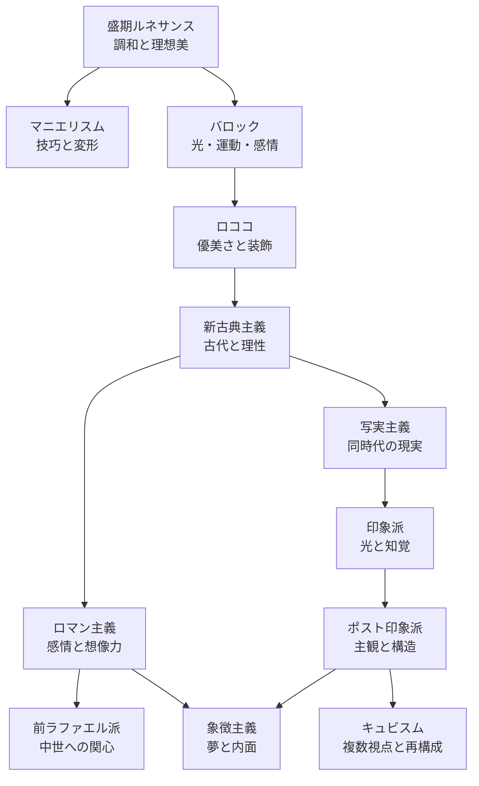

# 美術史メモ：ルネサンスからキュビスムまで

西洋絵画の主な動きを、16世紀初頭から20世紀初頭までの流れに沿って整理したメモです。
ここで挙げる「主義」や「運動」は、境界のはっきりした時代区分ではありません。地域や画家によって活動時期は重なり、同じ画家が複数の傾向を示すこともあります。

この年表は、作品を見たときに「何が変わったのか」を考えるための大まかな地図として使ってください。

---

## 1. 年表

    

        
1500年頃〜16世紀末

        

            <h3>盛期ルネサンス</h3>
            
レオナルド / ラファエロ / ミケランジェロ

            調和と理想美
        

        

            <h3>マニエリスム</h3>
            
パルミジャニーノ / ブロンズィーノ / エル・グレコ

            身体の変形と技巧性
        

        

            <h3>バロック</h3>
            
カラヴァッジョ / ルーベンス / レンブラント

            光・運動・感情
        

    

    

        
18世紀〜19世紀前半

        

            <h3>ロココ</h3>
            
ヴァトー / ブーシェ / フラゴナール

            優美さと装飾
        

        

            <h3>新古典主義</h3>
            
ダヴィッド / アングル

            古代・理性・明確な輪郭
        

        

            <h3>ロマン主義</h3>
            
ドラクロワ / ジェリコー / ターナー

            感情・想像力・自然
        

    

    

        
19世紀後半

        

            <h3>写実主義</h3>
            
クールベ / ミレー / ドーミエ

            日常・労働・現実
        

        

            <h3>前ラファエル派</h3>
            
ミレイ / ロセッティ / ホルマン・ハント

            中世・自然描写
        

        

            <h3>印象派</h3>
            
モネ / ルノワール / ドガ

            光・屋外制作・知覚
        

    

    

        
19世紀末〜20世紀初頭

        

            <h3>ポスト印象派</h3>
            
セザンヌ / ゴッホ / ゴーギャン

            主観・構造・色彩
        

        

            <h3>象徴主義</h3>
            
モロー / ルドン / クリムト

            夢・神話・内面
        

        

            <h3>キュビスム</h3>
            
ピカソ / ブラック

            複数視点・再構成
        

    

### 年代について

年代は活動が始まった時期の目安です。たとえば、印象派は1874年の第1回印象派展を一つの起点にできますが、その準備となる作品や交流はそれ以前から存在します。また、ポスト印象派は一つの統一運動というより、印象派以後の異なる方向性をまとめた美術史上の呼称です。

---

## 2. 影響関係と展開

次の図は、直接的な師弟関係や単純な因果関係ではなく、主な問題意識の受け渡しを大まかに示したものです。

実際の展開はこの図より複雑です。印象派と象徴主義のように、同じ時代に異なる関心が並行していた例もあります。運動同士を「優劣」や「進歩」の順番としてではなく、画家たちが異なる課題に応答した結果として見ると理解しやすくなります。

---

## 3. 各運動の要点

### 1. 盛期ルネサンス（1500年頃〜1520年頃）

遠近法、解剖学的な身体表現、明暗法、油彩技法が高い水準で統合され、調和・均衡・理想美が追求された時期です。レオナルドのスフマート、ラファエロの安定した構図、ミケランジェロの力強い人体表現は、それぞれ異なる到達点を示しています。

- **主要画家:** レオナルド・ダ・ヴィンチ、ラファエロ・サンティ、ミケランジェロ・ブオナローティ
- **代表作:** レオナルド《モナ・リザ》、ラファエロ《アテナイの学堂》

### 2. マニエリスム（1520年頃〜16世紀末）

盛期ルネサンスの均衡をそのまま再現するのではなく、引き伸ばされた身体、複雑なポーズ、人工的な色彩、不安定な空間によって画家の技巧を前面に出しました。名称はイタリア語の *maniera*（手法・様式）に由来します。

- **主要画家:** パルミジャニーノ、ブロンズィーノ、エル・グレコ
- **代表作:** パルミジャニーノ《長い首の聖母》

### 3. バロック（17世紀）

カトリック改革、宮廷文化、都市の発展などを背景に、見る者を画面へ引き込む劇的な表現が発達しました。強い明暗、斜めの構図、瞬間的な動き、身体や感情の臨場感が重要な要素です。画家によって宗教画、肖像画、風俗画、風景画への関心は大きく異なります。

- **主要画家:** カラヴァッジョ、ピーター・ポール・ルーベンス、レンブラント・ファン・レイン、ヨハネス・フェルメール
- **代表作:** カラヴァッジョ《聖マタイの召命》、フェルメール《真珠の耳飾りの少女》

### 4. ロココ（18世紀前半〜後半）

宮廷や都市の室内文化と結びつき、淡い色彩、曲線的な構図、恋愛や余暇を題材にした軽やかな表現を発展させました。重厚で劇的なバロックに対して、親密さや遊戯性、装飾性が前面に出ます。ただし、宗教画や歴史画が消えたわけではありません。

- **主要画家:** アントワーヌ・ヴァトー、フランソワ・ブーシェ、ジャン＝オノレ・フラゴナール
- **代表作:** ヴァトー《シテール島への巡礼》、フラゴナール《ぶらんこ》

### 5. 新古典主義（18世紀末〜19世紀初頭）

ポンペイやヘルクラネウムの発掘、啓蒙思想、フランス革命などを背景に、古代ギリシャ・ローマの造形と倫理的な物語を手本としました。明確な輪郭、安定した構図、抑制された感情表現が重視されます。

- **主要画家:** ジャック＝ルイ・ダヴィッド、ジャン＝オーギュスト・ドミニク・アングル
- **代表作:** ダヴィッド《サン＝ベルナール峠を越えるボナパルト》、アングル《グランド・オダリスク》

### 6. ロマン主義（19世紀前半）

新古典主義の規範や理性中心の価値観に対し、個人の感情、想像力、歴史の悲劇、自然の崇高さを重視しました。激しい色彩や動きが特徴ですが、ロマン主義は一つの技法ではなく、世界をどう感じるかという態度に近いものです。

- **主要画家:** ウジェーヌ・ドラクロワ、テオドール・ジェリコー、ウィリアム・ターナー
- **代表作:** ドラクロワ《民衆を導く自由の女神》、ターナー《雨、蒸気、速度――グレート・ウェスタン鉄道》

### 7. 写実主義（リアリズム、1840年代〜）

神話や理想化された歴史の場面だけでなく、同時代の社会と生活を主題にしようとした動きです。農民や労働者、都市の人々を大画面に描くことで、「何を描くに値するか」というアカデミーの価値基準にも問いを投げかけました。

- **主要画家:** ギュスターヴ・クールベ、ジャン＝フランソワ・ミレー、オノレ・ドーミエ
- **代表作:** クールベ《石割り人夫》、ミレー《落穂拾い》

### 8. 前ラファエル派（1848年〜）

イギリスで結成された運動です。ラファエロ以後のアカデミックな慣習に対して、ラファエロ以前の中世や初期ルネサンスに見られる鮮やかな色彩、細密な自然描写、精神性を再評価しました。文学や詩との結びつきも強く、単純な「過去への回帰」ではありません。

- **主要画家:** ジョン・エヴァレット・ミレイ、ダンテ・ゲイブリエル・ロセッティ、ウィリアム・ホルマン・ハント
- **代表作:** ミレイ《オフィーリア》

### 9. 印象派（1874年頃〜）

屋外制作や近代都市の風景を通して、光の変化とその瞬間の視覚体験を捉えようとしました。純色に近い絵具を画面上で隣接させる筆触、日常的な構図、素早い制作過程が重要な特徴です。ただし、すべての印象派画家が同じ技法を使ったわけではありません。

- **主要画家:** クロード・モネ、ピエール＝オーギュスト・ルノワール、エドガー・ドガ、カミーユ・ピサロ
- **代表作:** モネ《印象・日の出》、ルノワール《ムーラン・ド・ラ・ギャレットの舞踏会》

### 10. ポスト印象派（1880年代末〜）

印象派の後に現れた複数の方向性をまとめた呼称で、単一の運動ではありません。セザンヌは形態と構造、ゴッホは色彩と筆触、ゴーギャンは象徴的な色彩と平面的な構成を追求しました。絵画を目の前の光景の記録だけに限定しない点で、20世紀美術への重要な出発点となります。

- **主要画家:** ポール・セザンヌ、フィンセント・ファン・ゴッホ、ポール・ゴーギャン
- **代表作:** セザンヌ《サント＝ヴィクトワール山》、ゴッホ《星月夜》

### 11. 象徴主義（19世紀末）

外界を忠実に観察することよりも、夢、神話、死、欲望、宗教性など、目に見えない世界を表現しようとしました。象徴は一つの意味に固定されず、見る者の想像力を働かせる余地を残します。文学や音楽との交流も盛んでした。

- **主要画家:** ギュスターヴ・モロー、オディロン・ルドン、グスタフ・クリムト
- **代表作:** モロー《出現》、ルドン《キュクロプス》

### 12. キュビスム（1907年頃〜）

セザンヌの形態理解を出発点の一つとして、対象を単一の視点から写すのではなく、複数の視点や時間の情報を一つの画面に組み込みました。分析的キュビスムでは形態と色彩を分解し、総合的キュビスムでは新聞や壁紙などの異素材を画面に取り入れます。

- **主要画家:** パブロ・ピカソ、ジョルジュ・ブラック
- **代表作:** ピカソ《アヴィニョンの娘たち》、ブラック《ヴァイオリンとパレット》

---

## 4. 作品を見るときの問い

美術史の用語を覚えるだけでなく、次の問いを作品に当てると、運動同士の違いが見えやすくなります。

- 画面の空間は、単一の視点から組み立てられているか。
- 光は対象を説明しているか、それとも感情や劇性を生んでいるか。
- 輪郭は明確か。筆触や色面はどの程度独立しているか。
- 主題は神話や歴史か、日常生活か、画家の内面か。
- その作品は現実を再現しているのか、それとも現実の見方そのものを変えようとしているのか。

この視点を持つと、作品をラベルに当てはめるだけでなく、画家がどのような問題に向き合っていたのかを具体的に考えられます。
